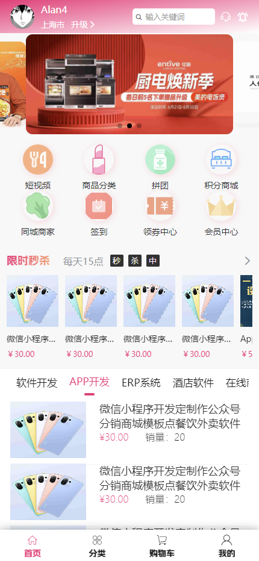
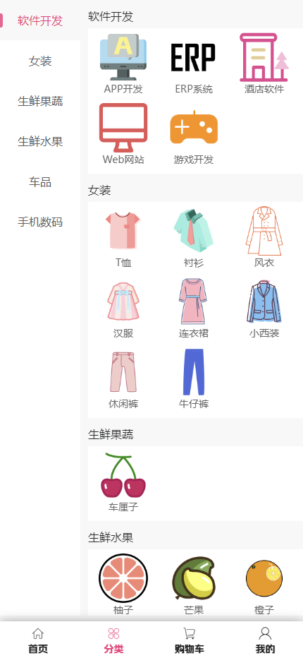
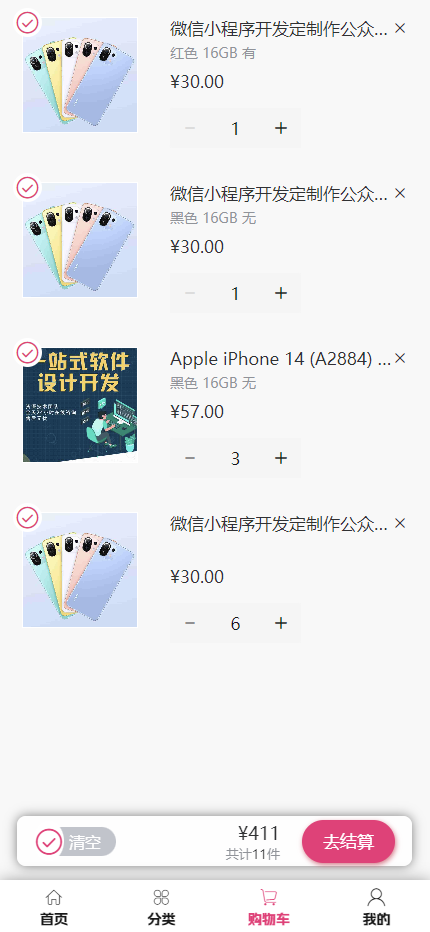
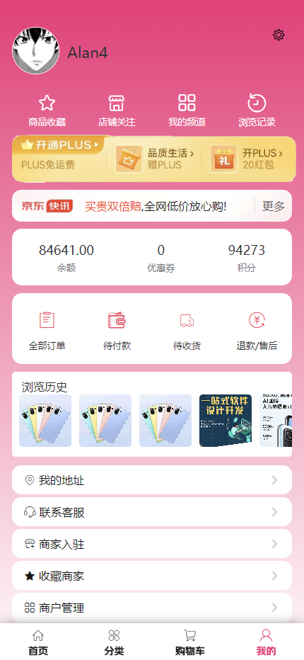

### 须知
##### 本项目EBSS（Enterprise Business  Software System）为企业级商业软件系统（这意味着您可完全免费的商用此系统），本项目所有前端源代码、后端源代码、产品Design UI、全开源且长期维护支持，并有相应的产品技术文档、产品视频教程、QQ\微信交流群方便开发者、企业快速二次开发、学习、商业使用技术支持，本项目作者咨询QQ：811565456、微信:http8s


#### 演示与说明
|  项目   | 演示地址 | 说明 |
|  :----:  | :----:  | :----:|
| 前端H5  | https://h.vivivi.club/h5| 前端H5、小程序和APP端效果一致，请用移动端打开 |
| PC端后台管理  | 	https://h.vivivi.club/admin| 已完成 |
| PC端商城  | https://h.vivivi.club/shop| 开发中 |


### QQ交流群
<a target="_blank" href="https://qm.qq.com/q/oIcEqjRxOo"></a>

### 项目说明

```
代码目录结构
|--sql 初始化数据库脚本 | 联系技术人员免费获取
|--ebss_java_backend JAVA相关api接口服务
|--ebss_php_backend PHP相关api接口服务
|--ebss_vue_admin PC端后台管理
|--ebss_mobile 苹果IOS APP，安卓APP、H5网页、微信公众号，微信小程序、支付宝小程序、抖音小程序
|--ebss_pc_shop PC端商城前端 | 待完善
|--ebss_website PC端官网前端 | 待开发
```

### 界面展示
#### 前端界面展示






